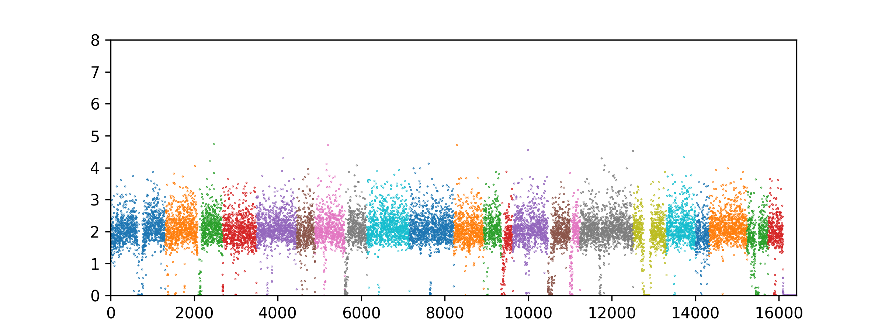

# CNV From BAM

`cnv_from_bam` is a Rust library developed to efficiently calculate dynamic Copy Number Variation (CNV) profiles from sequence alignments contained in BAM files. It seamlessly integrates with Python using PyO3, making it an excellent choice for bioinformatics workflows involving genomic data analysis.

## Features

- **Efficient Processing**: Optimized for handling large genomic datasets in BAM format.
- **Python Integration**: Built with PyO3 for easy integration into Python-based genomic analysis workflows.
- **Multithreading Support**: Utilizes Rust's powerful concurrency model for improved performance.
- **Dynamic Binning**: Bins the genome dynamically based on total read counts and genome length.
- **CNV Calculation**: Accurately calculates CNV values for each bin across different contigs.

## Installation

To use `cnv_from_bam` in your Rust project, add the following to your `Cargo.toml` file:

```toml
[dependencies]
cnv_from_bam = "0.1.0"  # Replace with the latest version
```

## Usage

Here's a quick example of how to use the `iterate_bam_file` function:

```rust
use cnv_from_bam::iterate_bam_file;
use std::path::PathBuf;

let bam_path = PathBuf::from("path/to/bam/file.bam");
// Iterate over the BAM file and calculate CNV values for each bin. Number of threads is set to 4 and mapping quality filter is set to 60.
// If number of threads is not specified, it defaults to the number of logical cores on the machine.
let result = iterate_bam_file(bam_path, Some(4), Some(60));
// Process the result...
```

The results in this case are returned as a CnvResult, which has the following structure:

```rust
pub struct CnvResult {
    pub cnv: FnvHashMap<String, Vec<f64>>,
    pub bin_width: usize,
    pub genome_length: usize,
}
```

Where `result.cnv` is a hash map containing the Copy Number for each bin of `bin_width` bases for each contig in the reference genome, `result.bin_width` is the width of the bins in bases, and `result.genome_length` is the total length of the genome.

Note that only the main primary mapping alignment start is binned, Supplementary and Secondary alignments are ignored.

Example simple plot in python
```python
from matplotlib import pyplot as plt
import matplotlib as mpl
import numpy as np
fig, ax = plt.subplots(nrows=1, ncols=1, figsize=(8, 3))
total = 0
let bam_path = PathBuf::from("path/to/bam/file.bam");
# Iterate over the BAM file and calculate CNV values for each bin. Number of threads is set to 4 and mapping quality filter is set to 60.
# If number of threads is not specified, it defaults to the number of logical cores on the machine.
let result = iterate_bam_file(bam_path, Some(4), Some(60));
for contig, cnv in result.cnv.items():
    ax.scatter(x=np.arange(len(cnv)) + total, y=cnv, s =0.1)
    total += len(cnv)

ax.set_ylim((0,8))
ax.set_xlim((0, total))
```
Should look something like this. Obviously the cnv data is just a dictionary of lists, so you can do whatever you want with it vis a vis matplotlib, seaborn, etc.

## Documentation

To generate the documentation, run:

```bash
cargo doc --open
```

## Contributing

Contributions to `cnv_from_bam` are welcome!

## License

This project is licensed under the [MIT License](LICENSE).

